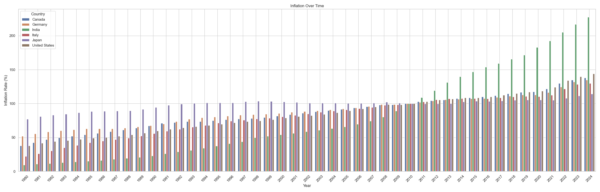
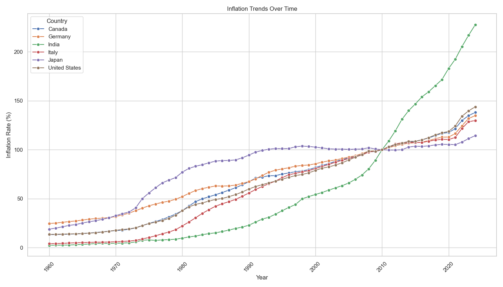

# Inflation Data Visualization Project

This project visualizes real-world inflation data of multiple countries across the years.
Goals -
 - Load and clean inflation data
 - Create easy to read visualizations using bar and line plots
 - Show inflation trends among countries across the years
 - Learn data cleaning, reshaping and visualization in Python

## Dataset
Source: [World Bank CPI Data](https://data.worldbank.org/indicator/FP.CPI.TOTL)

Columns Used: Year wise inflation rates for selected countries

## Tools Used
 - Python
 - pandas (for data cleaning and loading)
 - seaborn (for grouped bar plots and trends)
 - matplotlib (for customizing plots)
 - Visual Studio Code

## Charts Included
 - Grouped Bar Plot: Inflation rates of selected countries
 - Line Plot: Inflation trends over the years

## Sample Charts
 ### Bar Plot
 
 ### Line Plot
 

## How to Run
 1. Clone this repo:
 '''bash
 git clone https://github.com/ShikharSadhu/inflation-visualization.git
 2. Install the requirements:
 pip install pandas matplotlib seaborn
 3. Run the code:
 python inflation plot.py

## Author
Shikhar Sadhu

Bsc (Hons) Computer Science, University of Delhi

First year Data Science learner
